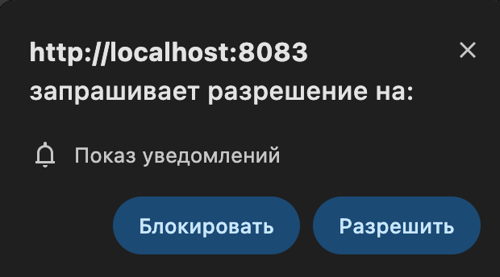

# SCHEMA


## How to start

1. run http client server

```sh
  http-server -p {port}
```

1. start express server in a separate terminal from the backend/src folder

```sh
  node server.js
```

* tested on node 18.x

3. subscribe to push notifications


* also in settings/notifications/allow notification (mac)


4. send push notification from server in a separate terminal from the backend/src folder

```sh
  node push.js
```

5. Done
